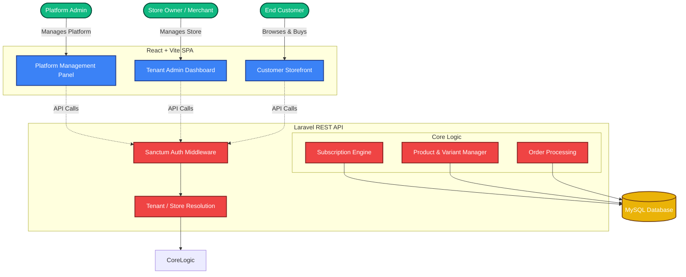

# Cartessa - Multi-Tenant E-Commerce SaaS Platform

**Candidate:** Naimur Rahman  
**Task:** Junior SaaS Full-Stack Engineer Task Submission

Cartessa is a comprehensive, multi-tenant e-commerce SaaS platform built with modern web technologies. It allows merchants to create, manage, and scale their own online stores while providing a seamless, premium shopping experience for customers.

---

## 🚀 Key Features

### 1. Platform Admin & Management
- **Centralized Dashboard:** Monitor platform health, active stores, and system-wide analytics.
- **Store Management:** View, approve, or suspend tenant stores.
- **Subscription Management:** Manage SaaS pricing tiers and handle tenant billing.

### 2. Merchant Dashboard (Tenant Level)
- **Product Management:** Full CRUD operations for products with complex **Dynamic Variant** support (e.g., Size, Color, Material).
- **Category Management:** Organize products with nested categories.
- **Order Management & Fulfillment:** Track order statuses, view customer details, and process shipments.
- **Sales Analytics & Reports:** Generate comprehensive sales reports with an **Auto-Print** and download functionality for streamlined accounting.

### 3. Premium Customer Storefront
- **Dynamic Glassmorphic UI:** A highly polished, animated, and modern shopping interface powered by **Framer Motion**.
- **Tenant Routing:** Automatic store resolution via URL slugs (e.g., `/awesome-store`).
- **Real-time Cart:** Client-side cart state management using React Context.
- **Responsive Design:** Flawless mobile, tablet, and desktop experiences.

---

## 🛠 Tech Stack

**Frontend:**
- **Framework:** React 18 (Vite)
- **Styling:** Tailwind CSS + Custom CSS Variables
- **Animations:** Framer Motion
- **Icons:** Lucide React
- **Routing:** React Router v6

**Backend:**
- **Framework:** Laravel 11 (PHP 8.2+)
- **Architecture:** RESTful API strictly separated from UI logic (No Inertia/Blade).
- **Authentication:** Laravel Sanctum (Token-based API Auth)
- **Database:** MySQL

---

## 🏛 System Architecture Diagram



---

## 📐 Architecture Concepts

- **Multi-tenant Isolation:** Complete data isolation achieved through `store_id` scoping on all core models (Products, Orders, Categories).
- **Flexible Product Variants:** Highly normalized database architecture separating `products`, `product_variants`, and `variant_attributes` to allow infinite permutations.
- **Financial Integrity:** Historical pricing locked safely at the time of purchase inside `order_items` to protect against future product price changes.
- **Headless Approach:** The backend serves exclusively as an API, completely decoupling the UI to allow for mobile apps or alternative frontends in the future.

---

## ⚙️ How to Run the Application Locally

### Prerequisites
- PHP >= 8.2
- Composer
- Node.js >= 18
- MySQL

### 1. Database Setup
Ensure your local MySQL server is running and create an empty database named `ecommerce_saas`.

### 2. Backend (Laravel API)
Navigate to the backend directory, install dependencies, and configure your environment:

```bash
cd backend
composer install
cp .env.example .env
php artisan key:generate
```
Ensure your `.env` file contains your database credentials:
```env
DB_CONNECTION=mysql
DB_HOST=127.0.0.1
DB_PORT=3306
DB_DATABASE=ecommerce_saas
DB_USERNAME=root
DB_PASSWORD=
```
Migrate the database and seed it with dummy data (Admin, Stores, Products, Subscriptions):
```bash
php artisan migrate:fresh --seed
php artisan serve
```
*The backend API will run on `http://127.0.0.1:8000`.*

### 3. Frontend (React SPA)
Open a new terminal tab, navigate to the frontend directory, install dependencies, and run the development server:

```bash
cd frontend
npm install
npm run dev
```

The frontend uses environment variables to communicate with the backend. 
Ensure to use `VITE_API_URL=http://localhost:8000/api` if necessary.
*The frontend will run on `http://127.0.0.1:5175`.*

---

*This application natively separates frontend UI logic from backend business logic entirely, discarding legacy Inertia architecture per architectural constraints.*

## 📐 Phase 3: Core Database Architecture

The core relational database schema has been designed with multi-store SaaS tenancy in mind.

### Architecture Concepts
- **Multi-tenant Isolation**: Store ownership securely mapped through `store_id` on products, categories, orders, and subscriptions to ensure data boundaries.
- **Packages & Subscriptions**: Groundwork for robust recurring subscription processing.
- **Product Variants**: Clean normalization linking dynamic `product_variants` and `variant_attributes` for extremely flexible multi-attribute models.
- **Financial Integrity**: Sales historically locked by migrating `unit_price` precisely to `order_items` retaining price changes inherently.
- **Headless Approach:** The backend serves exclusively as an API, completely decoupling the UI to allow for mobile apps or alternative frontends in the future.

To reset the entire architecture with fresh seed data:
```bash
cd backend
php artisan migrate:fresh --seed
```

---

### Default Credentials (from Database Seeder)
- **Platform Admin:** `admin@cartessa.com` / `password`
- **Merchant:** `naim@gmail.com` / `password`

---

## 🧭 Panel Routes Guide

Here are the specific URLs and routes to access different parts of the application when running locally:

| Panel / View | Local URL | Description |
| --- | --- | --- |
| **Landing Page** | `http://localhost:5175/` | Public SaaS marketing landing page. |
| **Merchant Login** | `http://localhost:5175/login` | Where merchants log in to manage their stores. |
| **Merchant Registration** | `http://localhost:5175/register` | Sign up page for new merchants. |
| **Merchant Dashboard** | `http://localhost:5175/admin` | Core tenant area (Products, Categories, Orders). |
| **Platform Admin Login** | `http://localhost:5175/management/login` | Login page for the super admin of the SaaS. |
| **Platform Admin Dashboard**| `http://localhost:5175/management` | Where the super admin monitors all stores/merchants. |
| **Customer Storefront** | `http://localhost:5175/:storeSlug` | The public e-commerce store (e.g. `/naim-gadgets`, `/rakib-fashion`). |

---

## 🧪 Testing the Storefront
Once running, you can access the seeded storefront by navigating to:  
`http://localhost:5175/naim-gadgets` (or whatever slug the seeder generates).

Enjoy the platform!
